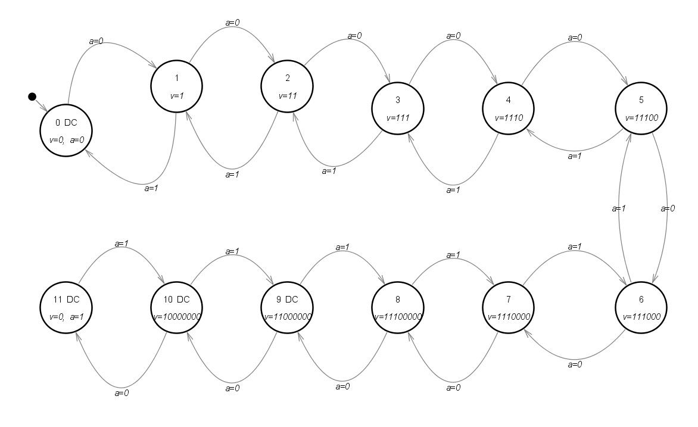

# LogBook 
## Día 16/11/2023

Tutoría individual con Mateo para aclaración de actividad "Kitt Display", se desarrolla  en la máquina de estado finitos (FSM) incluida en el programa Digital, también colaboramos en la realización de la práctica Clonezilla Server Lite.
 
*Detalle del mapa de estado de la sugerencia para la actividad "Kitt Display"*
