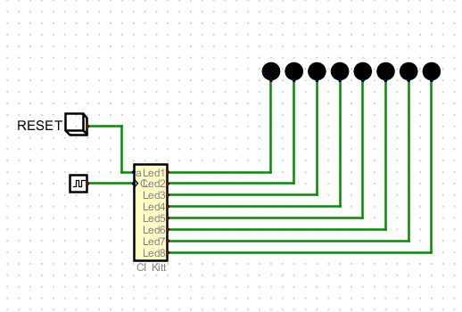

# LogBook 
## Día 17/11/2023

Finalización del bloque 3 de actividades de simulación digital, comienzo con la tercera parte que consiste en un reloj.
Enlace con láminas de diseño de los circuitos de la entrega simulación 3 :
https://drive.google.com/file/d/1AsbVdpDA42pb7PkDcFw1pagvGL3_Qg9N/view?usp=sharing
 

*Detalle del mapa de estado de la sugerencia para la actividad "Kitt Display"*
