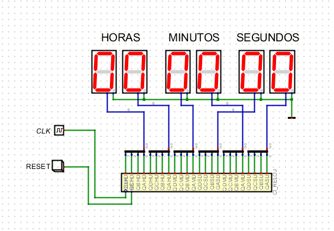

# LogBook 
## Día 18/11/2023

Realización y entrega del bloque de simulación 4 correspondiente a la actividad del reloj.
Enlace con láminas de diseño de los circuitos de la entrega simulación 4 :
https://drive.google.com/file/d/1BSb2nLIzO9UoXrNlz4xO-kdp5Jpt2D96/view?usp=sharing
 

*Detalle de simulación de la actividad del reloj*
