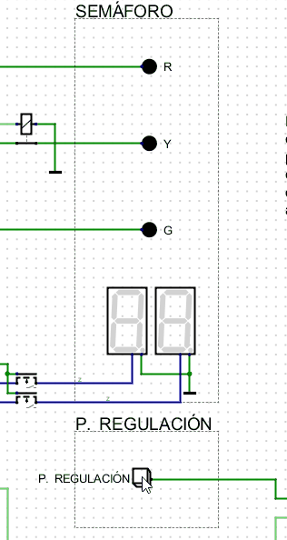

# LogBook 
## Día 30/11/2023

Esta semana ha sido muy dura, hemos tenido los exámenes correspondientes a la 1ª evaluación y está resultando agotadora. Por fin finalizo y entrego la actividad al completo de "Simulaciones digitales". También subiré un estracto de LogBook a su correspondiente apartado. Adjunto resultado última actividad "semáforo" del bloque de "Simulaciones digitales".

 

*Simulación actividad semáforo.*