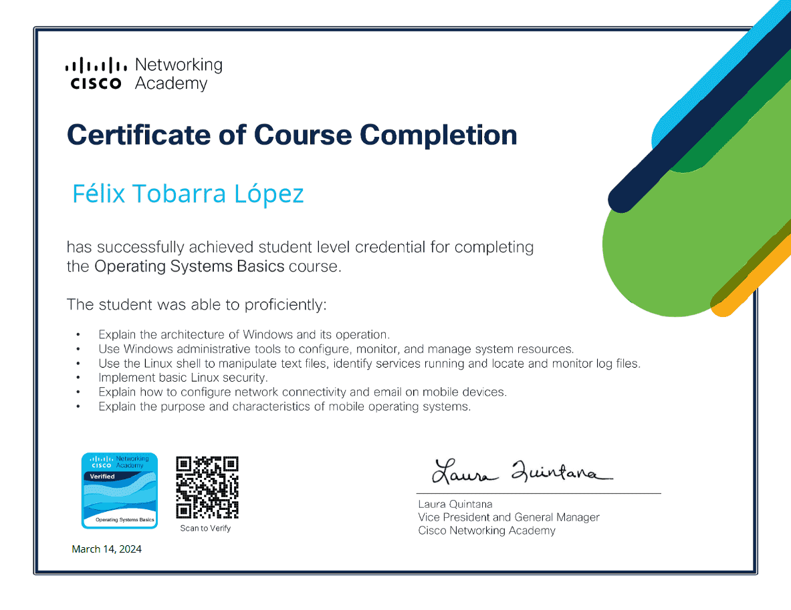

# LogBook 
## Día 11/03/2024

Continuo con el repaso del apartado "Redes-Networking" y superación del curso de CISCO sobre "Operating systems basics" en lengua inglesa, de la universidad Miguel Hernandez.

